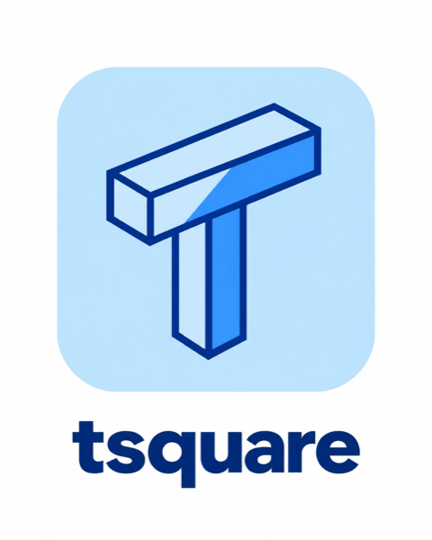

# tsquare docs

tsquare is a small text language for UI wireframes. A `.tsq` file describes a board of screens; the `tsquare` CLI checks it and renders it to SVG or PNG. It's built for models to write, and easy for people to read and edit.

- [Getting started](getting-started.md): render your first wireframe.
- [The language](language.md): lines, bare words, lists, comments, screens and devices, errors.
- [Components](components/README.md): every component with a rendered example, its source, and its props.
- [Icons](icons.md): where the icons come from, the common ones, and every name.
- [Colors](colors.md): the accent color, badge tones, and input errors.
- [Embedding](embedding.md): wireframes in Notion, GitHub and your own site.
- [Using it with AI](ai.md): the model prompt, the repair loop, and the Claude skill.
