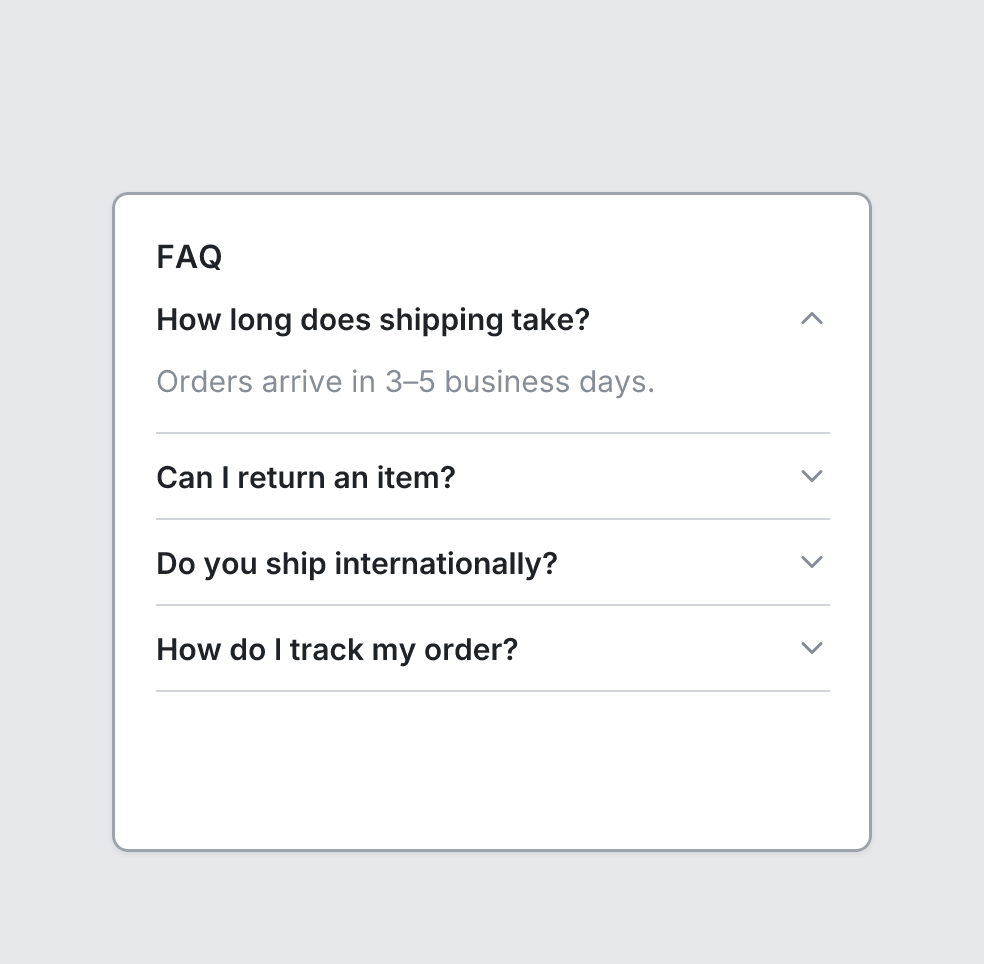

# Accordion

`accordion` · Layout · [All components](README.md)

Collapsible section: a title row with a chevron, children below when open. Stack several for an FAQ.



```tsquare
board
  screen custom width=380 height=330 gap=0
    heading "FAQ" level=3
    accordion "How long does shipping take?" open
      text "Orders arrive in 3–5 business days." muted
    accordion "Can I return an item?"
    accordion "Do you ship internationally?"
    accordion "How do I track my order?"
```

## Writing it

- A quoted string sets **title**: `accordion "…"`.
- `open` turns **open** on; `no-open` turns it off.
- Anything else is written `key=value`.
- Holds other elements: indent them two spaces below it.

## Props

| Prop | Values | Notes |
|---|---|---|
| `title` *(main text)* | string |  |
| `open` | boolean | Show the children. Default closed: only the title row |
