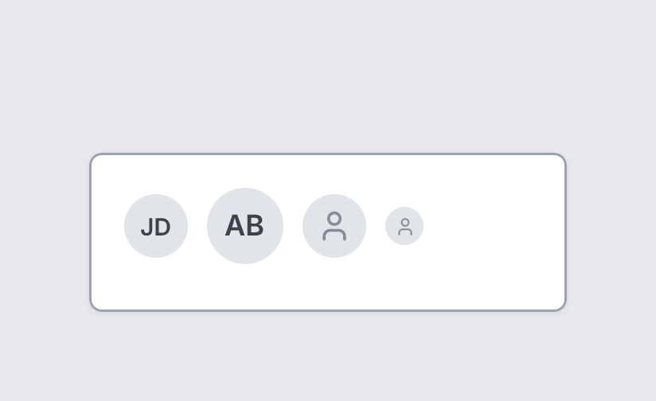

# Avatar

`avatar` · Content · [All components](README.md)

Round avatar with initials or a person silhouette.



```tsquare
board
  screen custom width=300 height=100
    stack row gap=12 align=center
      avatar "JD"
      avatar "AB" size=48
      avatar
      avatar size=24
```

## Writing it

- A word or quoted string sets **initials**: `avatar search` or `avatar "arrow-left"`.
- Anything else is written `key=value`.
- Has no children.

## Props

| Prop | Values | Notes |
|---|---|---|
| `initials` *(main text)* | string |  |
| `size` | number |  |
