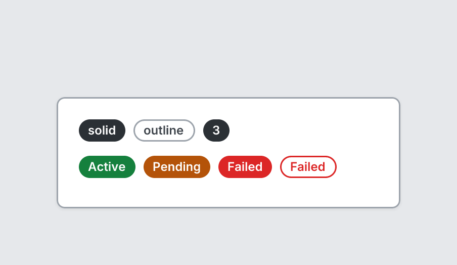

# Badge

`badge` · Content · [All components](README.md)

Small pill label for counts or statuses.



```tsquare
board
  screen custom width=340 height=110
    stack row gap=8
      badge "solid" variant=solid
      badge outline "outline"
      badge "3"
    stack row gap=8
      badge "Active" tone=success
      badge "Pending" tone=warning
      badge "Failed" tone=danger
      badge outline "Failed" tone=danger
```

## Writing it

- A quoted string sets **label**: `badge "…"`.
- Bare words set **variant**: `solid`, `outline`.
- Bare words set **tone**: `neutral`, `success`, `warning`, `danger`.
- Anything else is written `key=value`.
- Has no children.

## Props

| Prop | Values | Notes |
|---|---|---|
| `label` *(main text, required)* | string |  |
| `variant` | solid, outline |  |
| `tone` | neutral, success, warning, danger | Status color. Default neutral (the accent for solid badges) |
