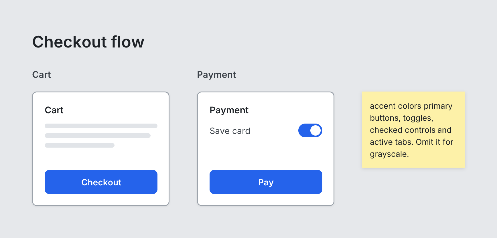

# Board

`board` · Canvas · [All components](README.md)

Root canvas (artboard). Holds Screens side by side, plus optional Notes. Must be the root element.



```tsquare
board row "Checkout flow" gap=48 accent=blue
  screen custom "Cart" width=240 height=200
    heading "Cart" level=3
    text lines=3
    spacer
    button primary "Checkout" fullWidth
  screen custom "Payment" width=240 height=200
    heading "Payment" level=3
    toggle "Save card" on
    spacer
    button primary "Pay" fullWidth
  note "accent colors primary buttons, toggles, checked controls and active tabs. Omit it for grayscale." width=180
```

## Writing it

- A quoted string sets **title**: `board "…"`.
- Bare words set **layout**: `row`, `grid`.
- Anything else is written `key=value`.
- Holds other elements: indent them two spaces below it.

## Props

| Prop | Values | Notes |
|---|---|---|
| `title` *(main text)* | string |  |
| `layout` | row, grid | row = all screens side by side; grid = wrap every `columns` screens |
| `columns` | number |  |
| `gap` | number |  |
| `padding` | number |  |
| `accent` | string | The one UI color: primary buttons, solid badges, checked controls, toggles, sliders, progress, selected days and pages, active tabs, ghost buttons. blue, indigo, violet, pink, red, orange, green, teal, or a hex color like #1a73e8. Omit for grayscale. |
