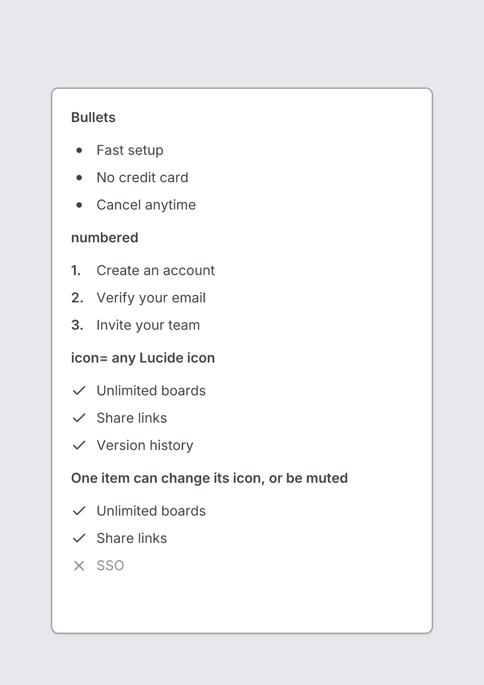

# Bullets

`bullets` · Content · [All components](README.md)

Bulleted, numbered or icon list of short lines.



```tsquare
board
  screen custom width=420 height=600
    text "Bullets" bold
    bullets items=[Fast setup, No credit card, Cancel anytime]
    text "numbered" bold
    bullets numbered items=[Create an account, Verify your email, Invite your team]
    text "icon= any Lucide icon" bold
    bullets icon=check items=[Unlimited boards, Share links, Version history]
    text "One item can change its icon, or be muted" bold
    bullets icon=check items=[Unlimited boards, Share links, {label="SSO" icon=x muted}]
```

## Writing it

- `numbered` turns **numbered** on; `no-numbered` turns it off.
- Anything else is written `key=value`.
- Has no children.

Icon names: see [Icons](../icons.md) for the common ones and every name.

## Props

| Prop | Values | Notes |
|---|---|---|
| `items` *(required)* | array of string, { label: string, icon: string, muted: boolean } | Text, or {label icon muted} to change one line, e.g. {label=SSO icon=x muted} |
| `numbered` | boolean | 1. 2. 3. instead of dots |
| `icon` | string | A Lucide icon instead of dots, e.g. check for a feature list |
