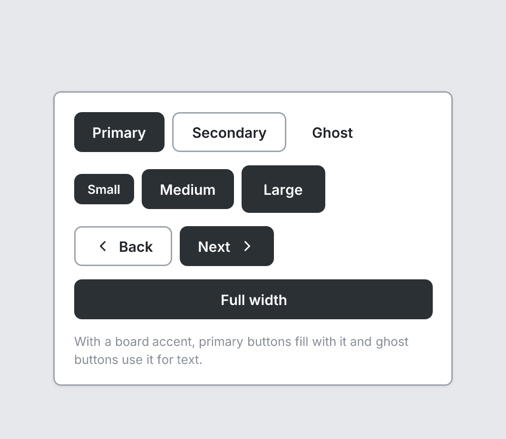

# Button

`button` · Controls · [All components](README.md)

Button. Primary is filled, secondary is outlined, ghost is text only.



```tsquare
board
  screen custom width=420 height=310
    stack row gap=8 align=center
      button primary "Primary"
      button secondary "Secondary"
      button ghost "Ghost"
    stack row gap=8 align=center
      button primary sm "Small"
      button primary "Medium"
      button primary lg "Large"
    stack row gap=8 align=center
      button secondary "Back" leadingIcon=chevron-left
      button primary "Next" trailingIcon=chevron-right
    button primary "Full width" fullWidth
    text "With a board accent, primary buttons fill with it and ghost buttons use it for text." sm muted
```

## Writing it

- A quoted string sets **label**: `button "…"`.
- Bare words set **variant**: `primary`, `secondary`, `ghost`.
- Bare words set **size**: `sm`, `md`, `lg`.
- `fullWidth` turns **fullWidth** on; `no-fullWidth` turns it off.
- Anything else is written `key=value`.
- Has no children.

Icon names: see [Icons](../icons.md) for the common ones and every name.

## Props

| Prop | Values | Notes |
|---|---|---|
| `label` *(main text)* | string |  |
| `variant` | primary, secondary, ghost |  |
| `size` | sm, md, lg |  |
| `leadingIcon` | string | Lucide icon before the label, e.g. chevron-left for Back |
| `trailingIcon` | string | Lucide icon after the label, e.g. chevron-right for Next |
| `fullWidth` | boolean |  |
