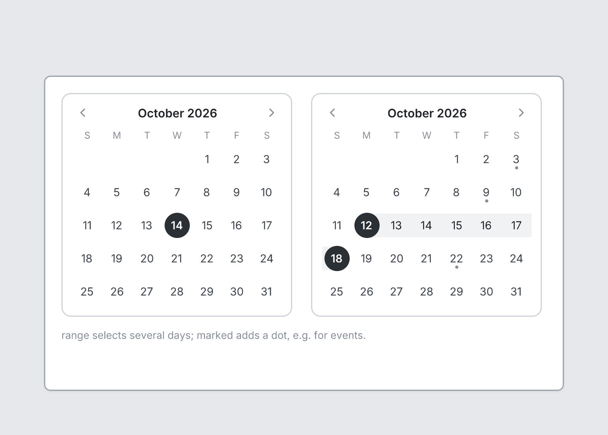

# Calendar

`calendar` · Controls · [All components](README.md)

Month calendar.



```tsquare
board
  screen custom width=660 height=400
    stack row gap=24 align=start
      calendar "October 2026" selected=14
      calendar "October 2026" range=[12, 18] marked=[3, 9, 22]
    text "range selects several days; marked adds a dot, e.g. for events." sm muted
```

## Writing it

- A quoted string sets **month**: `calendar "…"`.
- Anything else is written `key=value`.
- Has no children.

## Props

| Prop | Values | Notes |
|---|---|---|
| `month` *(main text)* | string | Month and year, e.g. "October 2026"; the days match that month |
| `selected` | number |  |
| `range` | [number, number] | Selected days, e.g. [12, 18] |
| `marked` | array of number | Days with a dot, e.g. events |
