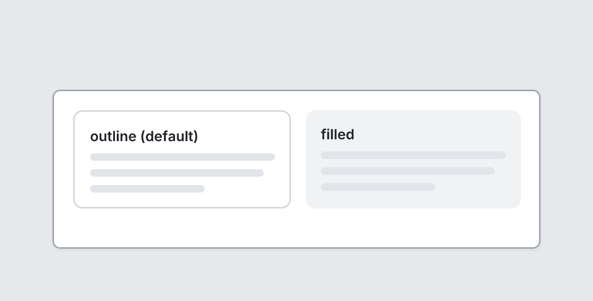

# Card

`card` · Layout · [All components](README.md)

Bordered container with optional title. Children stack vertically.



```tsquare
board
  screen custom width=520 height=170
    stack row gap=16
      card "outline (default)" grow
        text lines=3
      card "filled" variant=filled grow
        text lines=3
```

## Writing it

- A quoted string sets **title**: `card "…"`.
- Bare words set **variant**: `outline`, `filled`.
- `grow` turns **grow** on; `no-grow` turns it off.
- Anything else is written `key=value`.
- Holds other elements: indent them two spaces below it.

## Props

| Prop | Values | Notes |
|---|---|---|
| `title` *(main text)* | string |  |
| `padding` | number |  |
| `gap` | number |  |
| `variant` | outline, filled |  |
| `grow` | boolean |  |
| `width` | number, string | Fixed width, e.g. 320. Default fills the space. |
