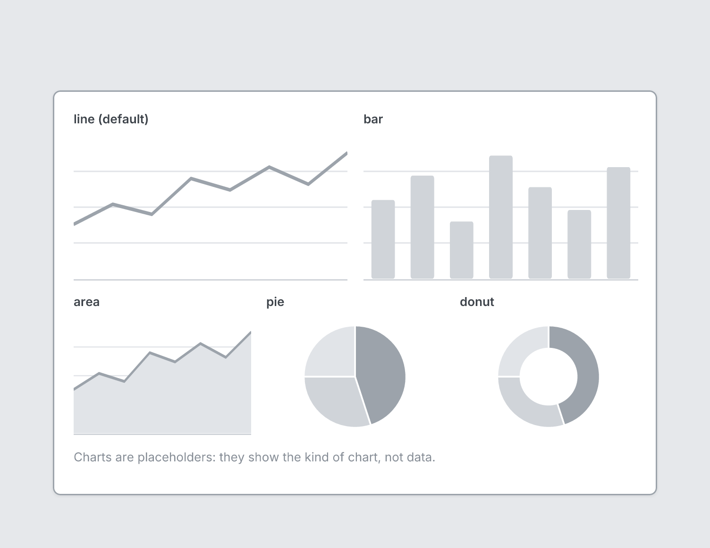

# Chart

`chart` · Content · [All components](README.md)

Chart placeholder: a generic line, bar, area, pie or donut shape, no data.



```tsquare
board
  screen custom width=640 height=430
    stack row gap=16
      chart line "line (default)"
      chart bar "bar"
    stack row gap=16
      chart area "area" height=150
      chart pie "pie" height=150
      chart donut "donut" height=150
    text "Charts are placeholders: they show the kind of chart, not data." sm muted
```

## Writing it

- A quoted string sets **title**: `chart "…"`.
- Bare words set **kind**: `line`, `bar`, `area`, `pie`, `donut`.
- Anything else is written `key=value`.
- Has no children.

## Props

| Prop | Values | Notes |
|---|---|---|
| `kind` | line, bar, area, pie, donut | Default line |
| `title` *(main text)* | string |  |
| `height` | number | Default 180 |
| `width` | number, string | Default fills the container width |
