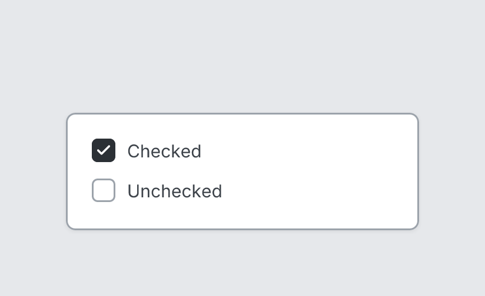

# Checkbox

`checkbox` · Controls · [All components](README.md)

Checkbox with label.



```tsquare
board
  screen custom width=300 height=100
    checkbox "Checked" checked
    checkbox "Unchecked"
```

## Writing it

- A quoted string sets **label**: `checkbox "…"`.
- `checked` and `unchecked` set whether it's checked.
- Anything else is written `key=value`.
- Has no children.

## Props

| Prop | Values | Notes |
|---|---|---|
| `label` *(main text)* | string |  |
| `checked` | boolean |  |
