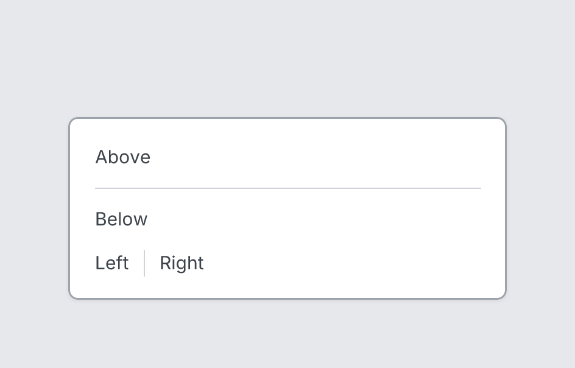

# Divider

`divider` · Layout · [All components](README.md)

Thin separator line.



```tsquare
board
  screen custom width=360 height=150
    text "Above"
    divider
    text "Below"
    stack row gap=12 align=center
      text "Left"
      divider vertical
      text "Right"
```

## Writing it

- `vertical` turns **vertical** on; `no-vertical` turns it off.
- Anything else is written `key=value`.
- Has no children.

## Props

| Prop | Values | Notes |
|---|---|---|
| `vertical` | boolean |  |
