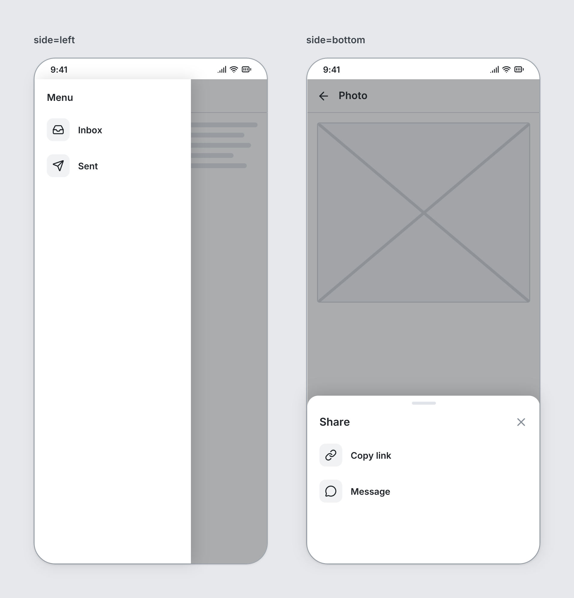

# Drawer

`drawer` · Overlays · [All components](README.md)

Panel sliding in from an edge: side nav (left), filters/details (right), or bottom sheet. Must be a direct child of a Screen, listed last.



```tsquare
board
  screen phone "side=left"
    navbar "Inbox" leading=menu
    text lines=6
    drawer left size=260
      heading "Menu" level=3
      list dividers=false
        listitem "Inbox" leadingIcon=inbox
        listitem "Sent" leadingIcon=send
  screen phone "side=bottom"
    navbar "Photo" leading=back
    image height=300
    drawer bottom "Share" size=280
      list dividers=false
        listitem "Copy link" leadingIcon=link
        listitem "Message" leadingIcon=message-circle
```

## Writing it

- A quoted string sets **title**: `drawer "…"`.
- Bare words set **side**: `left`, `right`, `bottom`.
- `scrim` turns **scrim** on; `no-scrim` turns it off.
- `handle` turns **handle** on; `no-handle` turns it off.
- Anything else is written `key=value`.
- Holds other elements: indent them two spaces below it.

## Props

| Prop | Values | Notes |
|---|---|---|
| `side` | left, right, bottom |  |
| `title` *(main text)* | string |  |
| `size` | number | Width for left/right, height for bottom |
| `scrim` | boolean | Dim the screen behind. Default true. |
| `handle` | boolean | Grab handle on bottom sheets. Default true for bottom. |
