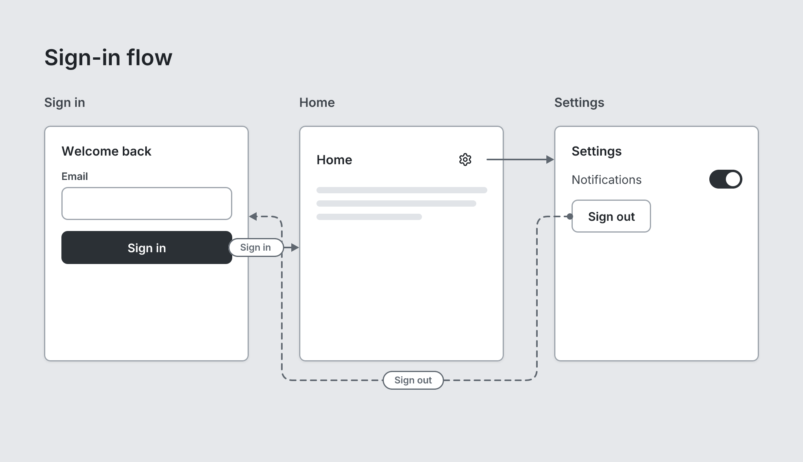

# Flow

`flow` · Canvas · [All components](README.md)

An arrow between two elements or screens, named with #id. Written at the board level after the screens: flow signin -> home "Tap Sign in".



```tsquare
board "Sign-in flow"
  screen custom "Sign in" width=260 height=300 #signin
    heading "Welcome back" level=3
    input "Email"
    button primary "Sign in" fullWidth #submit
  screen custom "Home" width=260 height=300 #home
    stack row justify=between align=center
      heading "Home" level=3
      button ghost leadingIcon=settings #gear
    text lines=3
  screen custom "Settings" width=260 height=300 #settings
    heading "Settings" level=3
    toggle "Notifications" on
    button secondary "Sign out" #signout
  flow submit -> home "Sign in"
  flow gear -> settings
  flow signout -> signin "Sign out" dashed start=dot
```

## Writing it

- After the two ends, a quoted string sets **label**: `flow submit -> home "…"`.
- Bare words set **line**: `rounded`, `hard`, `curved`, `straight`.
- `none`, `arrow`, `dot`, `circle`, `bar` are options of **start** and **end**, so write which one you mean: `start=none` or `end=none`.
- `dashed` turns **dashed** on; `no-dashed` turns it off.
- Anything else is written `key=value`.
- Has no children.

## Props

| Prop | Values | Notes |
|---|---|---|
| `from` *(required)* | string | The id where the arrow starts (written before ->) |
| `to` *(required)* | string | The id it points at (written after ->) |
| `label` *(main text)* | string |  |
| `start` | none, arrow, dot, circle, bar | Default none |
| `end` | none, arrow, dot, circle, bar | Default arrow |
| `line` | rounded, hard, curved, straight | Default rounded: right angles with rounded corners |
| `dashed` | boolean |  |
| `color` | string | Default gray. blue, indigo, violet, pink, red, orange, green, teal, a hex color, or accent for the board's |
