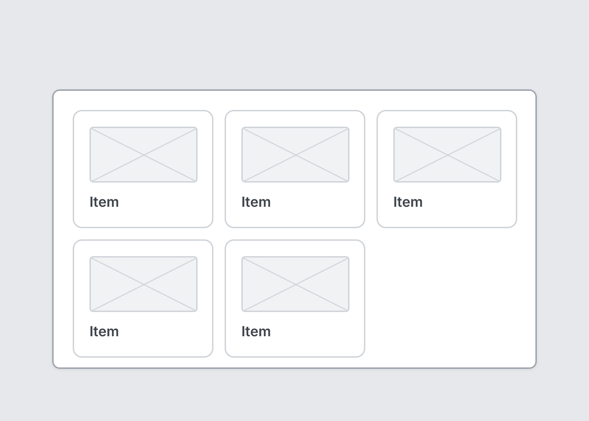

# Grid

`grid` · Layout · [All components](README.md)

Equal-width columns that wrap. Good for card grids and galleries.



```tsquare
board
  screen custom width=520 height=300
    grid columns=3 gap=12
      card
        image height=60
        text "Item" bold
      card
        image height=60
        text "Item" bold
      card
        image height=60
        text "Item" bold
      card
        image height=60
        text "Item" bold
      card
        image height=60
        text "Item" bold
```

## Writing it

- Anything else is written `key=value`.
- Holds other elements: indent them two spaces below it.

## Props

| Prop | Values | Notes |
|---|---|---|
| `columns` *(required)* | number |  |
| `gap` | number |  |
| `padding` | number |  |
