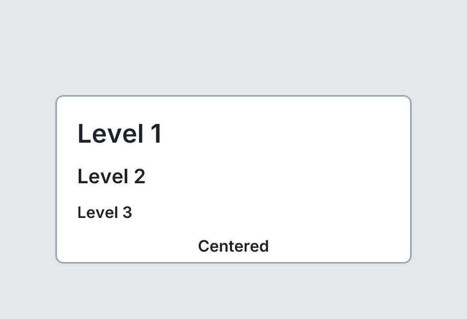

# Heading

`heading` · Content · [All components](README.md)

Heading text, level 1 (largest) to 3.



```tsquare
board
  screen custom width=360 height=170
    heading "Level 1" level=1
    heading "Level 2" level=2
    heading "Level 3" level=3
    heading "Centered" level=3 align=center
```

## Writing it

- A quoted string sets **text**: `heading "…"`.
- Bare words set **align**: `left`, `center`, `right`.
- Anything else is written `key=value`.
- Has no children.

## Props

| Prop | Values | Notes |
|---|---|---|
| `text` *(main text, required)* | string |  |
| `level` | 1, 2, 3 |  |
| `align` | left, center, right |  |
