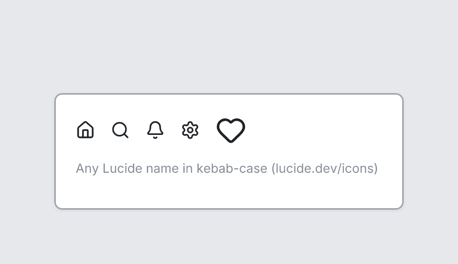

# Icon

`icon` · Content · [All components](README.md)

Line icon from Lucide, or a brand logo (brand-google, brand-apple, …).



```tsquare
board
  screen custom width=360 height=120
    stack row gap=16 align=center
      icon home
      icon search
      icon bell
      icon settings
      icon heart size=32
    text "Any Lucide name in kebab-case (lucide.dev/icons)" sm muted
```

## Writing it

- A word or quoted string sets **name**: `icon search` or `icon "arrow-left"`.
- Anything else is written `key=value`.
- Has no children.

Icon names: see [Icons](../icons.md) for the common ones and every name.

## Props

| Prop | Values | Notes |
|---|---|---|
| `name` *(main text)* | string | Lucide icon name in kebab-case, e.g. menu, search, arrow-left, settings, bell, user |
| `size` | number |  |
