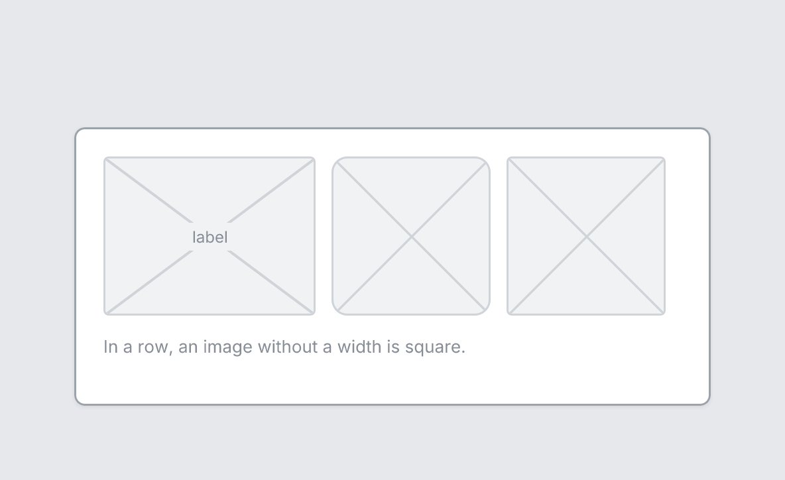

# Image

`image` · Content · [All components](README.md)

Image placeholder: a box with an X through it.



```tsquare
board
  screen custom width=480 height=210
    stack row gap=12
      image "label" height=120 width=160
      image height=120 width=120 rounded
      image height=120
    text "In a row, an image without a width is square." sm muted
```

## Writing it

- A quoted string sets **label**: `image "…"`.
- `rounded` turns **rounded** on; `no-rounded` turns it off.
- Anything else is written `key=value`.
- Has no children.

## Props

| Prop | Values | Notes |
|---|---|---|
| `height` | number |  |
| `width` | number, string | Default fills the container width |
| `label` *(main text)* | string |  |
| `rounded` | boolean |  |
