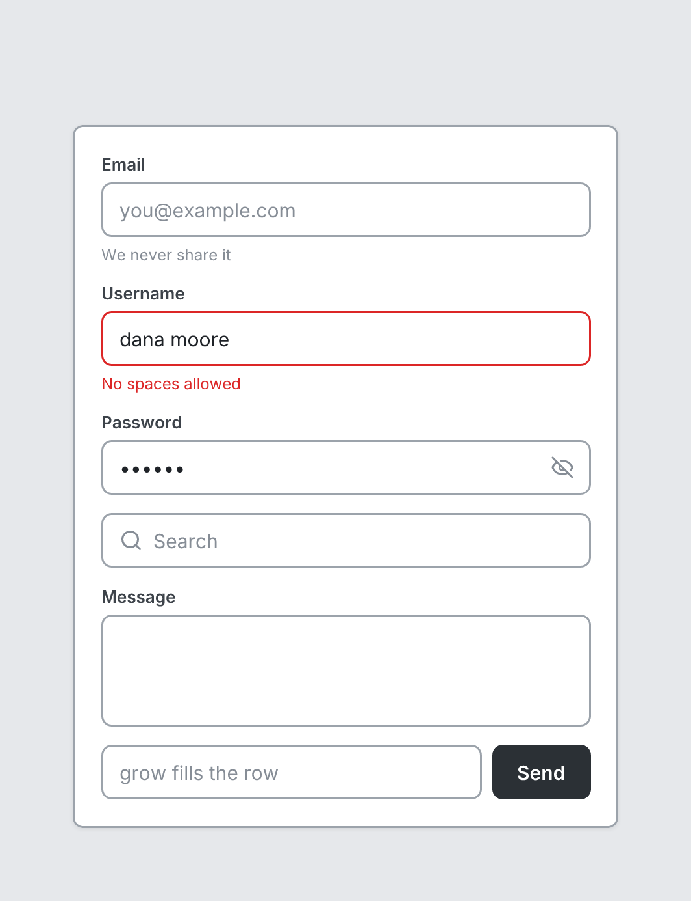

# Input

`input` · Controls · [All components](README.md)

Text field with optional label. Set multiline for a textarea.



```tsquare
board
  screen custom width=420 height=540
    input "Email" placeholder="you@example.com" helper="We never share it"
    input "Username" value="dana moore" error helper="No spaces allowed"
    input password "Password" value=secret
    input search placeholder="Search"
    input "Message" multiline=3
    stack row gap=8
      input placeholder="grow fills the row" grow
      button primary "Send"
```

## Writing it

- A quoted string sets **label**: `input "…"`.
- Bare words set **type**: `text`, `password`, `search`, `email`.
- `error` turns **error** on; `no-error` turns it off.
- `grow` turns **grow** on; `no-grow` turns it off.
- Anything else is written `key=value`.
- Has no children.

## Props

| Prop | Values | Notes |
|---|---|---|
| `label` *(main text)* | string |  |
| `placeholder` | string |  |
| `value` | string |  |
| `type` | text, password, search, email |  |
| `multiline` | number | Number of rows; 2 or more makes a textarea |
| `helper` | string |  |
| `error` | boolean | Validation error: red border and red helper text |
| `grow` | boolean | Fill the remaining space in a row |
| `width` | number, string | Fixed width, e.g. 320. Default fills the space. |
