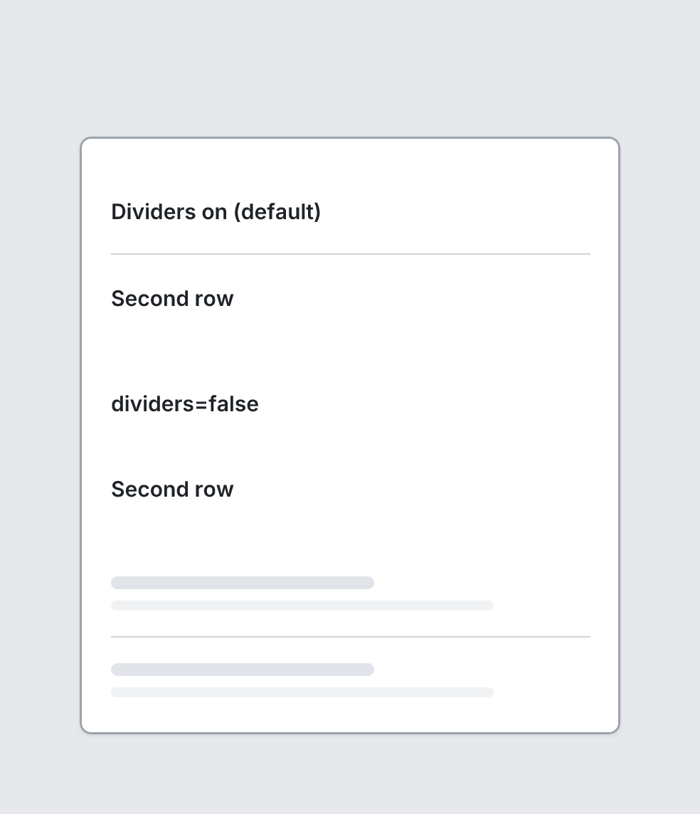

# List

`list` · Navigation & data · [All components](README.md)

Vertical list of ListItems.



```tsquare
board
  screen custom width=380 height=420
    list
      listitem "Dividers on (default)"
      listitem "Second row"
    list dividers=false
      listitem "dividers=false"
      listitem "Second row"
    list
      listitem
      listitem
```

## Writing it

- `dividers` turns **dividers** on; `no-dividers` turns it off.
- `grow` turns **grow** on; `no-grow` turns it off.
- Anything else is written `key=value`.
- Holds other elements: indent them two spaces below it.

## Props

| Prop | Values | Notes |
|---|---|---|
| `dividers` | boolean |  |
| `grow` | boolean |  |
