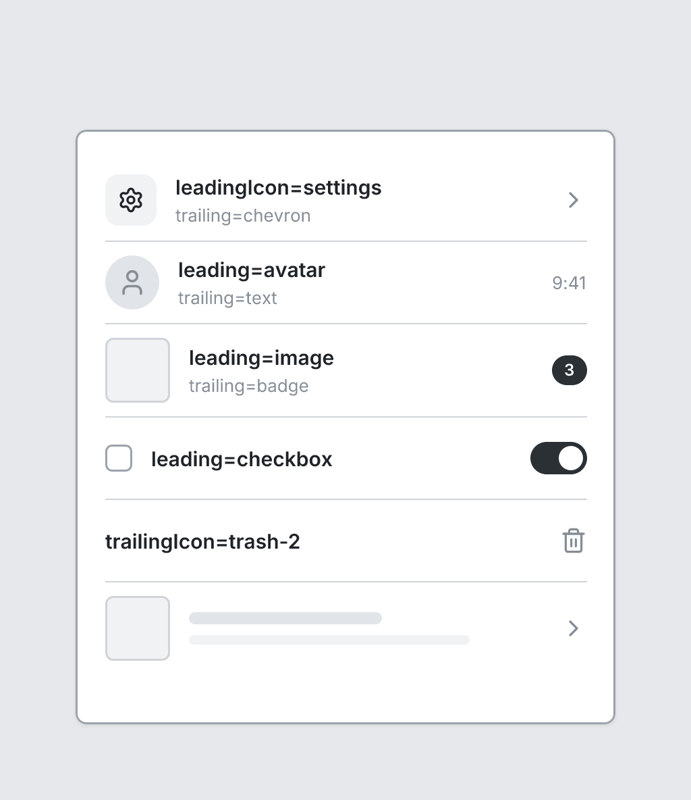

# ListItem

`listitem` · Navigation & data · [All components](README.md)

Row in a List. Omit title for a placeholder bar.



```tsquare
board
  screen custom width=400 height=440
    list
      listitem "leadingIcon=settings" subtitle="trailing=chevron" leadingIcon=settings trailing=chevron
      listitem "leading=avatar" subtitle="trailing=text" leading=avatar trailing=text trailingText="9:41"
      listitem "leading=image" subtitle="trailing=badge" leading=image trailing=badge trailingText="3"
      listitem "leading=checkbox" leading=checkbox trailing=toggle
      listitem "trailingIcon=trash-2" trailingIcon=trash-2
      listitem leading=image trailing=chevron
```

## Writing it

- A quoted string sets **title**: `listitem "…"`.
- Bare words set **leading**: `avatar`, `image`, `checkbox`.
- Bare words set **trailing**: `chevron`, `toggle`, `text`, `badge`.
- `none`, `icon` are options of **leading** and **trailing**, so write which one you mean: `leading=none` or `trailing=none`.
- Anything else is written `key=value`.
- Has no children.

Icon names: see [Icons](../icons.md) for the common ones and every name.

## Props

| Prop | Values | Notes |
|---|---|---|
| `title` *(main text)* | string |  |
| `subtitle` | string |  |
| `leading` | none, icon, avatar, image, checkbox |  |
| `leadingIcon` | string | Lucide icon on the left; setting it implies leading=icon |
| `trailing` | none, chevron, toggle, text, badge, icon |  |
| `trailingText` | string | Text for trailing=text or badge; setting it implies trailing=text |
| `trailingIcon` | string | Lucide icon on the right; setting it implies trailing=icon |
