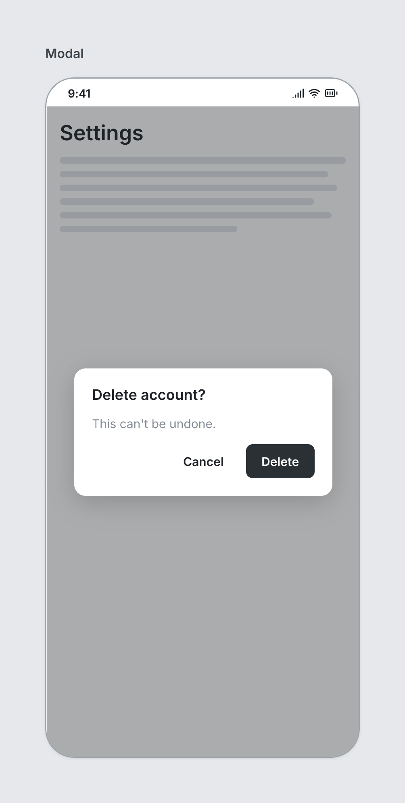

# Modal

`modal` · Overlays · [All components](README.md)

Centered dialog over the screen. Must be a direct child of a Screen, listed last.



```tsquare
board
  screen phone "Modal"
    heading "Settings"
    text lines=6
    modal "Delete account?"
      text "This can't be undone." muted
      stack row justify=end gap=8
        button ghost "Cancel"
        button primary "Delete"
```

## Writing it

- A quoted string sets **title**: `modal "…"`.
- `scrim` turns **scrim** on; `no-scrim` turns it off.
- Anything else is written `key=value`.
- Holds other elements: indent them two spaces below it.

## Props

| Prop | Values | Notes |
|---|---|---|
| `title` *(main text)* | string |  |
| `width` | number |  |
| `scrim` | boolean | Dim the screen behind. Default true. |
