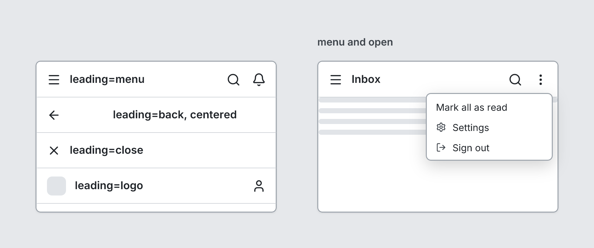

# NavBar

`navbar` · Navigation & data · [All components](README.md)

Top app bar. Place first in a Screen.



```tsquare
board
  screen custom width=380 height=240 padding=0 gap=0
    navbar "leading=menu" leading=menu actions=[search, bell]
    navbar "leading=back, centered" leading=back align=center actions=[share]
    navbar "leading=close" leading=close
    navbar "leading=logo" leading=logo actions=[user]
  screen custom "menu and open" width=380 height=240 padding=0 gap=0
    navbar "Inbox" leading=menu actions=[search] open menu=[Mark all as read, {label=Settings icon=settings}, {label=Sign out icon=log-out}]
    text lines=4
```

## Writing it

- A quoted string sets **title**: `navbar "…"`.
- Bare words set **leading**: `none`, `menu`, `back`, `close`, `logo`.
- Bare words set **align**: `left`, `center`.
- `open` turns **open** on; `no-open` turns it off.
- Anything else is written `key=value`.
- Has no children.

## Props

| Prop | Values | Notes |
|---|---|---|
| `title` *(main text)* | string |  |
| `leading` | none, menu, back, close, logo |  |
| `actions` | array of string | Icon names shown on the right |
| `align` | left, center |  |
| `menu` | array of string, { label: string, icon: string } | A menu under the last action (adds ⋮ if needed), shown when open |
| `open` | boolean | Show the menu |
