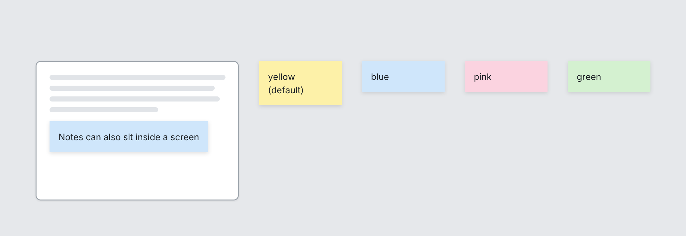

# Note

`note` · Canvas · [All components](README.md)

Sticky-note annotation. Put it on the Board beside screens, or inside a Screen next to what it explains.



```tsquare
board gap=32
  screen custom width=320 height=220
    text lines=4
    note "Notes can also sit inside a screen" color=blue
  note "yellow (default)" width=130
  note "blue" color=blue width=130
  note "pink" color=pink width=130
  note "green" color=green width=130
```

## Writing it

- A quoted string sets **text**: `note "…"`.
- Bare words set **color**: `yellow`, `blue`, `pink`, `green`.
- Anything else is written `key=value`.
- Has no children.

## Props

| Prop | Values | Notes |
|---|---|---|
| `text` *(main text, required)* | string |  |
| `color` | yellow, blue, pink, green |  |
| `width` | number |  |
