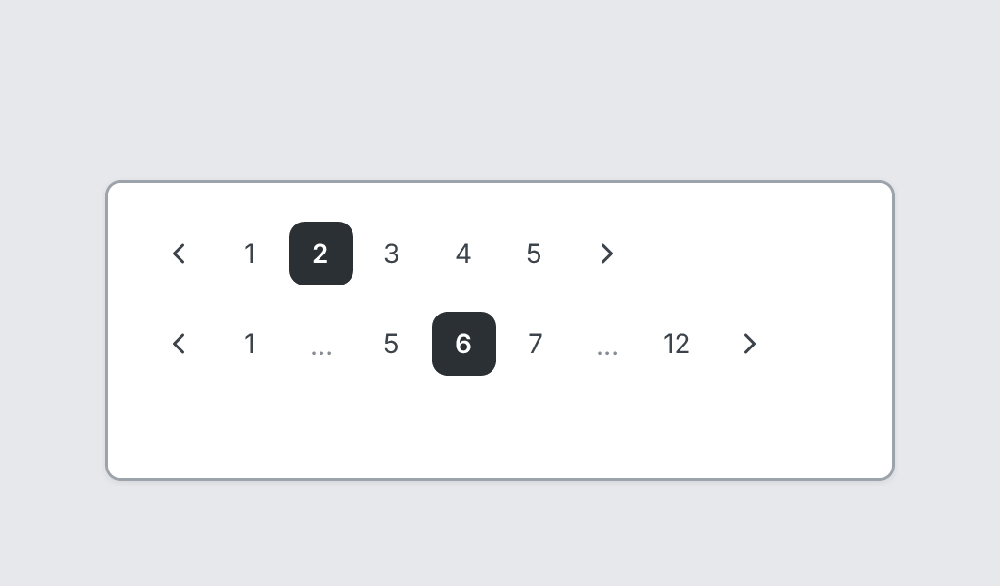

# Pagination

`pagination` · Navigation & data · [All components](README.md)

Page numbers with previous and next.



```tsquare
board
  screen custom width=420 height=160
    pagination pages=5 current=2
    pagination pages=12 current=6
```

## Writing it

- Anything else is written `key=value`.
- Has no children.

## Props

| Prop | Values | Notes |
|---|---|---|
| `pages` *(required)* | number |  |
| `current` | number | Default 1 |
