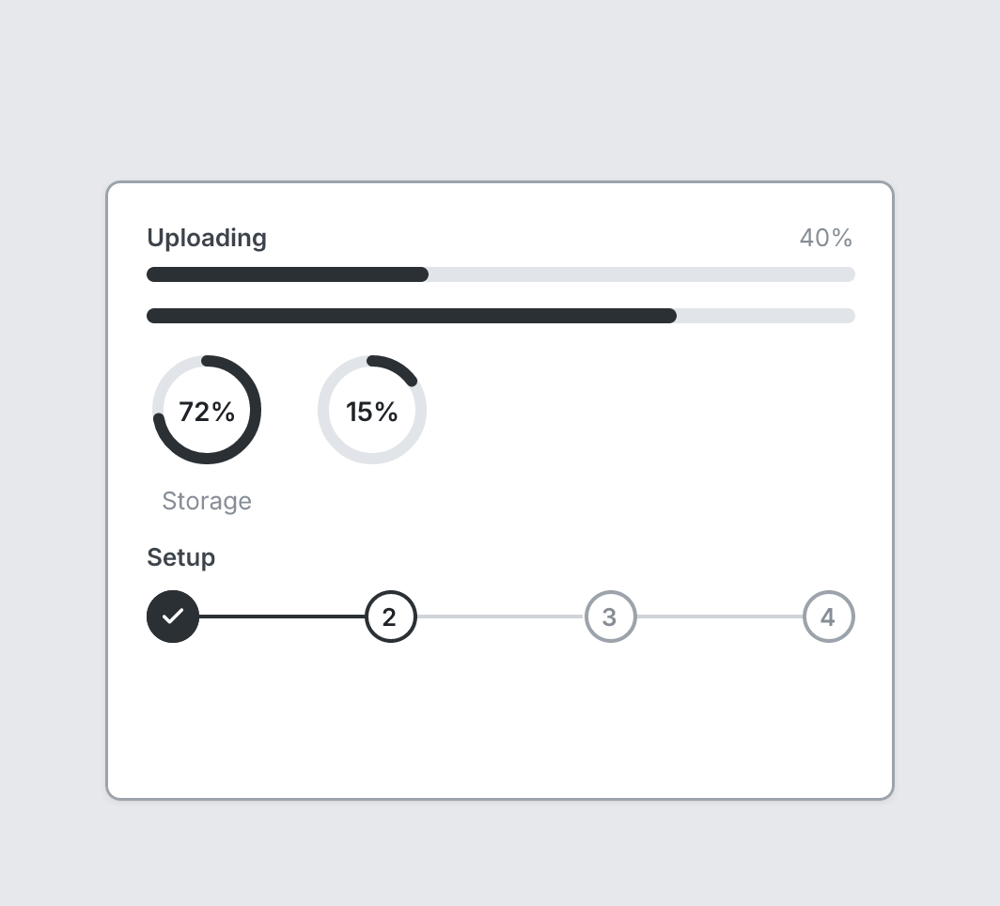

# Progress

`progress` · Controls · [All components](README.md)

Progress bar, ring (circle), or stepper (steps).



```tsquare
board
  screen custom width=420 height=330
    progress "Uploading" value=40
    progress value=75
    stack row gap=24
      progress circle "Storage" value=72
      progress circle value=15
    progress "Setup" steps=4 step=2
```

## Writing it

- A quoted string sets **label**: `progress "…"`.
- Bare words set **shape**: `bar`, `circle`.
- Anything else is written `key=value`.
- Has no children.

## Props

| Prop | Values | Notes |
|---|---|---|
| `label` *(main text)* | string |  |
| `value` | number | Percent done |
| `shape` | bar, circle | Default bar; circle is a ring with the percent inside |
| `steps` | number | Draw a stepper with this many steps instead |
| `step` | number | The current step, with steps |
