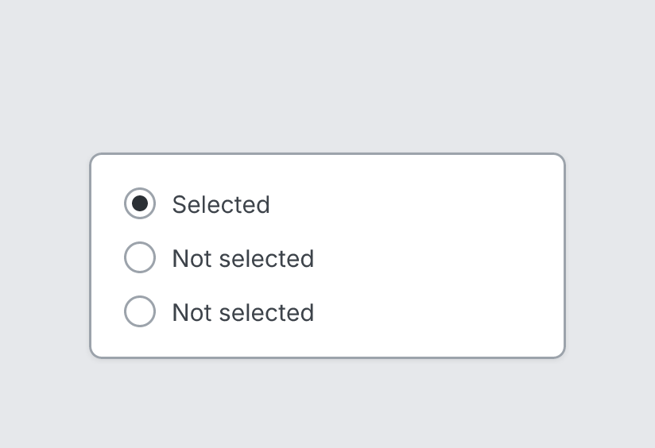

# Radio

`radio` · Controls · [All components](README.md)

Radio button with label.



```tsquare
board
  screen custom width=300 height=130
    radio "Selected" checked
    radio "Not selected"
    radio "Not selected"
```

## Writing it

- A quoted string sets **label**: `radio "…"`.
- `checked` and `unchecked` set whether it's checked.
- Anything else is written `key=value`.
- Has no children.

## Props

| Prop | Values | Notes |
|---|---|---|
| `label` *(main text)* | string |  |
| `checked` | boolean |  |
