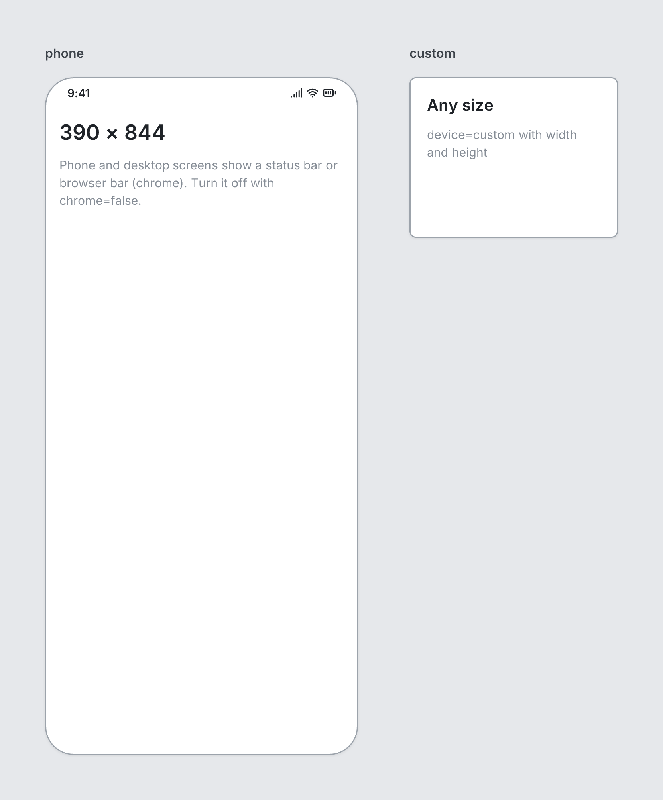

# Screen

`screen` · Canvas · [All components](README.md)

One view of the product in a device frame. Children stack vertically.



```tsquare
board
  screen phone "phone"
    heading "390 × 844"
    text "Phone and desktop screens show a status bar or browser bar (chrome). Turn it off with chrome=false." muted
  screen custom "custom" width=260 height=200
    heading "Any size" level=2
    text "device=custom with width and height" muted
```

## Writing it

- A quoted string sets **name**: `screen "…"`.
- Bare words set **device**: `phone`, `tablet`, `desktop`, `custom`.
- `chrome` turns **chrome** on; `no-chrome` turns it off.
- Anything else is written `key=value`.
- Holds other elements: indent them two spaces below it.

## Props

| Prop | Values | Notes |
|---|---|---|
| `name` *(main text)* | string | Label shown above the screen |
| `device` | phone, tablet, desktop, custom |  |
| `width` | number | Overrides the device width |
| `height` | number | Overrides the device height, e.g. height=1400 for a long scrolling page |
| `chrome` | boolean | Phone status bar / desktop browser bar. Default true for phone and desktop. |
| `padding` | number |  |
| `gap` | number |  |
