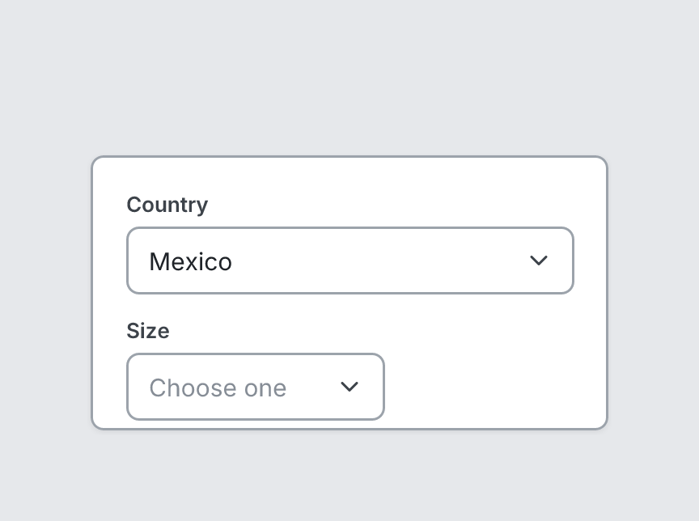

# Select

`select` · Controls · [All components](README.md)

Dropdown field (closed state).



```tsquare
board
  screen custom width=320 height=170
    select "Country" value="Mexico"
    select "Size" placeholder="Choose one" width=160
```

## Writing it

- A quoted string sets **label**: `select "…"`.
- Anything else is written `key=value`.
- Has no children.

## Props

| Prop | Values | Notes |
|---|---|---|
| `label` *(main text)* | string |  |
| `value` | string |  |
| `placeholder` | string |  |
| `width` | number, string | Fixed width, e.g. 320. Default fills the space. |
