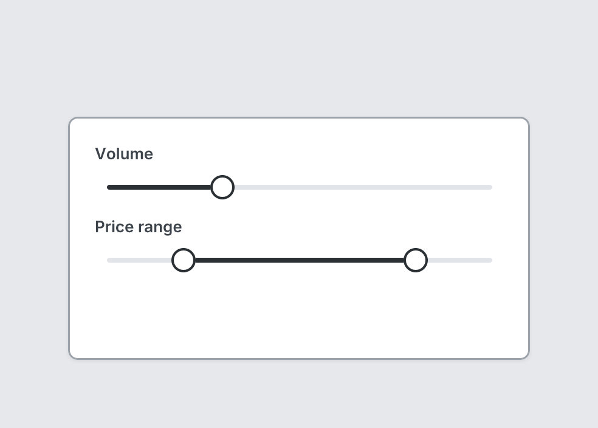

# Slider

`slider` · Controls · [All components](README.md)

Slider with one handle, or two with `range`.



```tsquare
board
  screen custom width=380 height=200
    slider "Volume" value=30
    slider "Price range" range=[20, 80]
```

## Writing it

- A quoted string sets **label**: `slider "…"`.
- Anything else is written `key=value`.
- Has no children.

## Props

| Prop | Values | Notes |
|---|---|---|
| `label` *(main text)* | string |  |
| `value` | number | Handle position: 0 to 100, or any amount (the track scales to fit) |
| `range` | [number, number] | Two handles instead, e.g. [20, 80] or [50, 400] |
