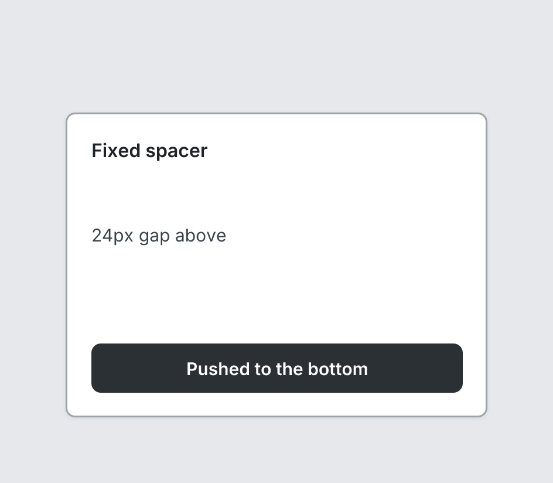

# Spacer

`spacer` · Layout · [All components](README.md)

Empty space. Without a size it grows to push siblings apart.



```tsquare
board
  screen custom width=360 height=260
    heading "Fixed spacer" level=3
    spacer size=24
    text "24px gap above"
    spacer
    button primary "Pushed to the bottom" fullWidth
```

## Writing it

- Anything else is written `key=value`.
- Has no children.

## Props

| Prop | Values | Notes |
|---|---|---|
| `size` | number | Fixed size in px. Omit to fill remaining space. |
