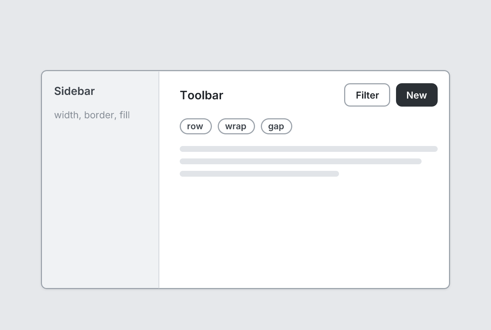

# Stack

`stack` · Layout · [All components](README.md)

Flex container. The main layout primitive (rows, columns, sidebars, toolbars).



```tsquare
board
  screen custom width=560 height=300 padding=0
    stack row grow
      stack width=160 border=right fill padding=16 gap=12
        text "Sidebar" bold
        text "width, border, fill" sm muted
      stack grow padding=16 gap=16
        stack row justify=between align=center
          heading "Toolbar" level=3
          stack row gap=8
            button secondary sm "Filter"
            button primary sm "New"
        stack row wrap gap=8
          badge outline "row"
          badge outline "wrap"
          badge outline "gap"
        text lines=3
```

## Writing it

- Bare words set **direction**: `row`, `column`.
- Bare words set **align**: `stretch`.
- Bare words set **justify**: `between`, `around`.
- Bare words set **border**: `none`, `right`, `left`, `top`, `bottom`, `all`.
- `start`, `center`, `end` are options of **align** and **justify**, so write which one you mean: `align=start` or `justify=start`.
- `wrap` turns **wrap** on; `no-wrap` turns it off.
- `grow` turns **grow** on; `no-grow` turns it off.
- `fill` turns **fill** on; `no-fill` turns it off.
- Anything else is written `key=value`.
- Holds other elements: indent them two spaces below it.

## Props

| Prop | Values | Notes |
|---|---|---|
| `direction` | row, column |  |
| `gap` | number |  |
| `padding` | number |  |
| `align` | start, center, end, stretch |  |
| `justify` | start, center, end, between, around |  |
| `wrap` | boolean |  |
| `grow` | boolean | Fill remaining space in the parent |
| `width` | number, string | Fixed width, e.g. 240 for a sidebar |
| `border` | none, right, left, top, bottom, all |  |
| `fill` | boolean | Light gray background |
