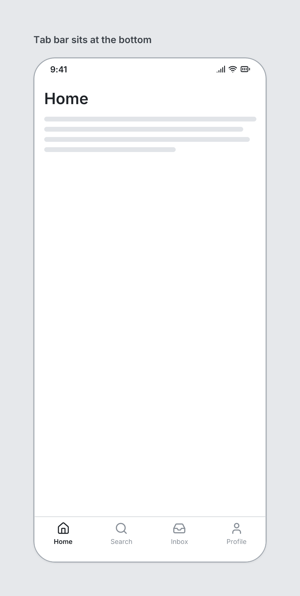

# TabBar

`tabbar` · Navigation & data · [All components](README.md)

Bottom tab bar for mobile. Place last in a Screen (before overlays).



```tsquare
board
  screen phone "Tab bar sits at the bottom"
    heading "Home"
    text lines=4
    tabbar items=[{label=Home icon=house}, {label=Search icon=search}, {label=Inbox icon=inbox}, {label=Profile icon=user}] active=0
```

## Writing it

- Anything else is written `key=value`.
- Has no children.

## Props

| Prop | Values | Notes |
|---|---|---|
| `items` *(required)* | array of { label: string, icon: string } |  |
| `active` | number |  |
