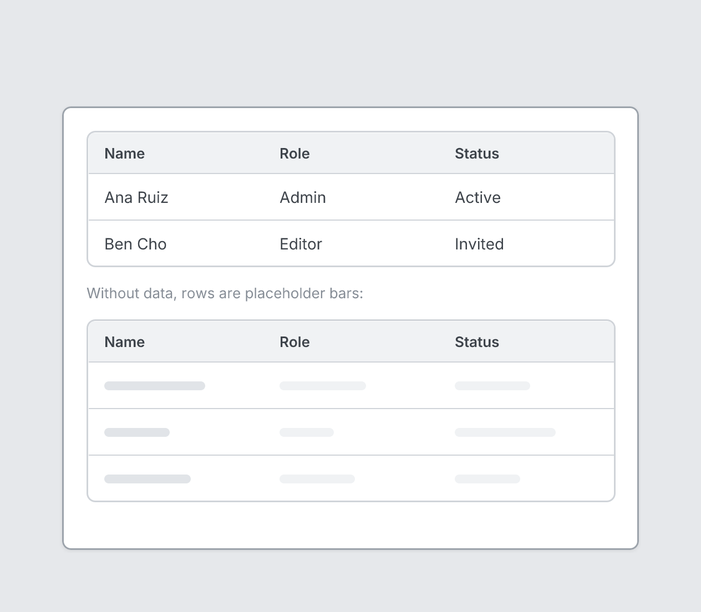

# Table

`table` · Navigation & data · [All components](README.md)

Table with headers. Rows are placeholder bars unless `data` is given.



```tsquare
board
  screen custom width=520 height=400
    table columns=[Name, Role, Status] data=[["Ana Ruiz", Admin, Active], ["Ben Cho", Editor, Invited]]
    text "Without data, rows are placeholder bars:" sm muted
    table columns=[Name, Role, Status] rows=3
```

## Writing it

- Anything else is written `key=value`.
- Has no children.

## Props

| Prop | Values | Notes |
|---|---|---|
| `columns` *(required)* | array of string |  |
| `rows` | number | Placeholder rows when `data` is not given |
| `data` | array of array of string |  |
