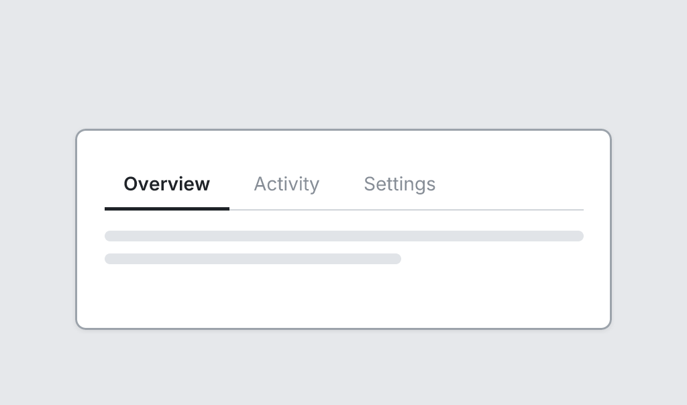

# Tabs

`tabs` · Navigation & data · [All components](README.md)

In-page tabs with an underline on the active one.



```tsquare
board
  screen custom width=400 height=150
    tabs items=[Overview, Activity, Settings] active=0
    text lines=2
```

## Writing it

- Anything else is written `key=value`.
- Has no children.

## Props

| Prop | Values | Notes |
|---|---|---|
| `items` *(required)* | array of string |  |
| `active` | number |  |
