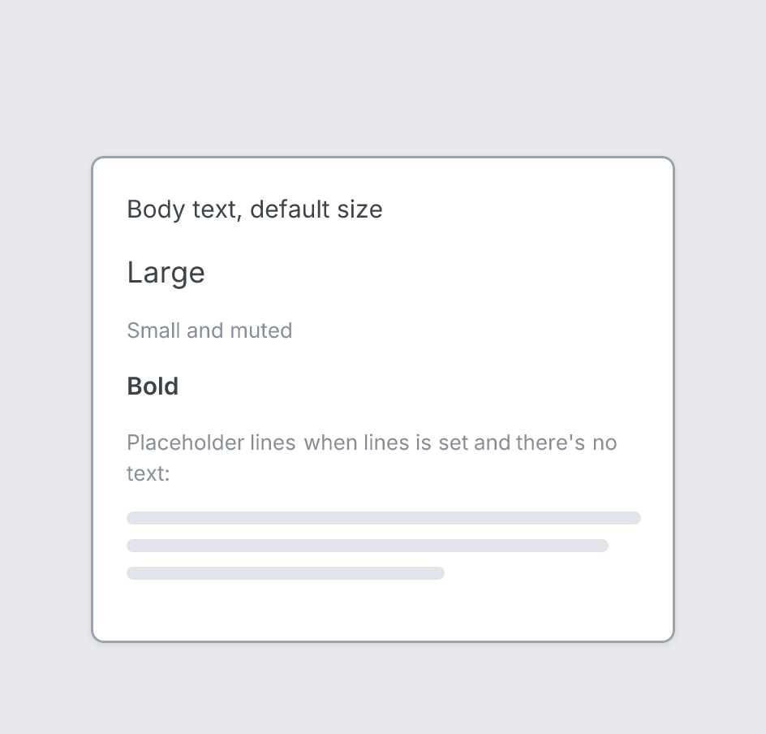

# Text

`text` · Content · [All components](README.md)

Body text, or placeholder lines when `lines` is set and `text` is not.



```tsquare
board
  screen custom width=360 height=300
    text "Body text, default size"
    text lg "Large"
    text sm "Small and muted" muted
    text "Bold" bold
    text "Placeholder lines when lines is set and there's no text:" sm muted
    text lines=3
```

## Writing it

- A quoted string sets **text**: `text "…"`.
- Bare words set **size**: `sm`, `md`, `lg`.
- Bare words set **align**: `left`, `center`, `right`.
- `muted` turns **muted** on; `no-muted` turns it off.
- `bold` turns **bold** on; `no-bold` turns it off.
- Anything else is written `key=value`.
- Has no children.

## Props

| Prop | Values | Notes |
|---|---|---|
| `text` *(main text)* | string |  |
| `lines` | number | Draw N placeholder lines instead of real text |
| `size` | sm, md, lg |  |
| `muted` | boolean |  |
| `bold` | boolean |  |
| `align` | left, center, right |  |
