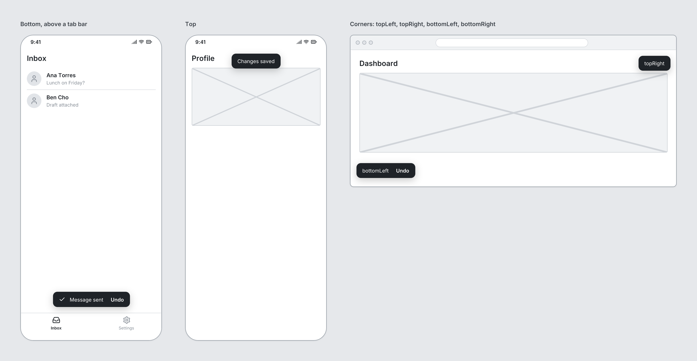

# Toast

`toast` · Overlays · [All components](README.md)

Short message over the screen, e.g. after saving. Must be a direct child of a Screen, listed last.



```tsquare
board
  screen phone "Bottom, above a tab bar"
    heading "Inbox" level=2
    list
      listitem "Ana Torres" subtitle="Lunch on Friday?" leading=avatar
      listitem "Ben Cho" subtitle="Draft attached" leading=avatar
    tabbar items=[{label=Inbox icon=inbox}, {label=Settings icon=settings}]
    toast "Message sent" action="Undo" icon=check
  screen phone "Top"
    heading "Profile" level=2
    image height=160
    toast "Changes saved" position=top
  screen desktop "Corners: topLeft, topRight, bottomLeft, bottomRight" width=900 height=420
    heading "Dashboard" level=2
    image height=220
    toast "topRight" position=topRight
    toast "bottomLeft" action="Undo" position=bottomLeft
```

## Writing it

- A quoted string sets **text**: `toast "…"`.
- Bare words set **position**: `bottom`, `top`, `topLeft`, `topRight`, `bottomLeft`, `bottomRight`.
- Anything else is written `key=value`.
- Has no children.

Icon names: see [Icons](../icons.md) for the common ones and every name.

## Props

| Prop | Values | Notes |
|---|---|---|
| `text` *(main text)* | string |  |
| `action` | string | A text button, e.g. "Undo" |
| `icon` | string | Lucide icon name in kebab-case, e.g. menu, search, arrow-left, settings, bell, user |
| `position` | bottom, top, topLeft, topRight, bottomLeft, bottomRight | Default bottom (centered), above a TabBar |
