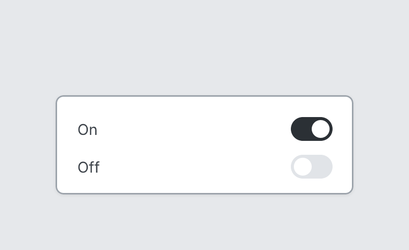

# Toggle

`toggle` · Controls · [All components](README.md)

On/off switch with label on the left.



```tsquare
board
  screen custom width=300 height=100
    toggle "On" on
    toggle "Off" off
```

## Writing it

- A quoted string sets **label**: `toggle "…"`.
- `on` and `off` switch it on and off.
- Anything else is written `key=value`.
- Has no children.

## Props

| Prop | Values | Notes |
|---|---|---|
| `label` *(main text)* | string |  |
| `on` | boolean |  |
