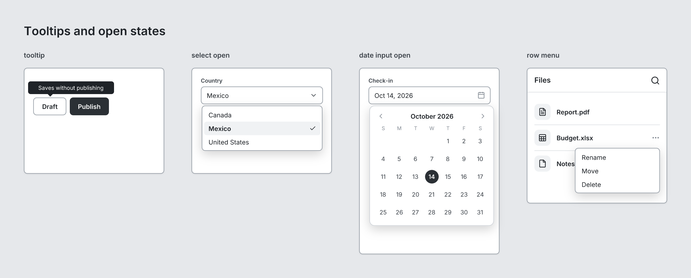

# The language

A tsquare file (`.tsq`) describes one **board**: a canvas with one or more **screens** side by side, and optional **notes** beside them. This page covers how to write it. For what each component does, see [Components](components/README.md).

```tsquare
board "Sign-up flow"
  screen phone "1 · Details"
    navbar "Create account" leading=back
    input "Name"
    input email "Email" placeholder="you@example.com"
    checkbox "I agree to the terms"
    button primary "Continue" fullWidth
  screen phone "2 · Done"
    heading "You're in" level=1
    text "Check your inbox to confirm your email." muted
  note "Confirmation email copy is TBD" color=pink
```

## Lines and indentation

- **One element per line.** The line starts with the component name, in lowercase.
- **Children are indented two spaces** under their parent. A screen's children stack from top to bottom.
- **The first line is the board.** Everything else is indented under it.
- Blank lines are ignored.

## Anatomy of a line

```tsquare
    button primary lg "Sign in" fullWidth leadingIcon=log-in
```

| Part | What it does |
|---|---|
| `button` | the component |
| `primary`, `lg` | **bare words** that set options: `primary` sets `variant`, `lg` sets `size` |
| `"Sign in"` | a **quoted string** sets the component's main text: a button's label, a heading's text, a screen's name |
| `fullWidth` | a **switch**: naming a yes/no prop turns it on |
| `icon=log-in` | **`key=value`** sets any prop |

The order doesn't matter. `button "Sign in" lg primary` is the same button.

### Quoted strings

Use double or single quotes: `"Sign in"` or `'Sign in'`. Inside quotes, write `\"` for a quote character. Each component has one main-text prop, marked **main text** on its component page; a quoted string always fills that one. Components without one (such as `stack`) don't take a quoted string.

`icon` and `avatar` also accept their main text as a bare word: `icon search`, `avatar JD`.

### Bare words: options and switches

A bare word is one of a component's option values (`phone`, `primary`, `row`, `sm`, `bottom`…) or the name of a yes/no prop (`checked`, `fullWidth`, `grow`, `muted`…). Each component page lists the words it accepts under **Writing it**.

To turn a switch off, write `no-` in front of it (`no-dividers`), or use `off` and `unchecked` for toggles and checkboxes: `toggle "Wi-Fi" off`, `checkbox "Remember me" unchecked`.

If a word is an option of two props, write which one you mean. On a stack, `center` could be `align` or `justify`, so write `align=center` or `justify=center`.

### `key=value`

`key=value` works for every prop. Values can be:

| Value | Example |
|---|---|
| a quoted string | `placeholder="you@example.com"` |
| a single word | `value=Travel`, `icon=arrow-left` (see [Icons](icons.md)) |
| a number | `gap=12`, `width=240` |
| `true` or `false` | `dividers=false` |
| a list | `items=[All notes, Pinned, Shared]` |
| an object | `{label=Home icon=house}` |
| a color | `accent=#1a73e8` |

### Lists

Lists go in square brackets, with **items separated by commas**. An item can contain spaces without quotes:

```tsquare
    tabs items=[All notes, Pinned, Shared]
    table columns=[Name, Role, Status] data=[[Ana Torres, Admin, Active], [Ben Cho, Editor, Invited]]
```

To put a comma inside an item, quote the item: `["$1,200", "Smith, J"]`. A number in a list of text is fine: `tabs items=[2023, 2024]`.

A missing comma joins two items into one: `actions=[search bell]` is a single item, "search bell".

### Objects

Objects go in curly braces, as `key=value` pairs separated by spaces (commas are also fine). A bare word turns an option on, as on an element line. Tab bars use a list of objects:

```tsquare
    tabbar items=[{label=Home icon=house}, {label=Search icon=search}] active=0
```

A list can also mix plain items and objects, when only some items need options. Bullets do this to change one line:

```tsquare
    bullets icon=check items=[Unlimited boards, Share links, {label="SSO" icon=x muted}]
```

### Comments

A line that starts with `#` is a comment. **A comment must be on its own line:** it can't follow an element on the same line.

```tsquare
board
  # the main screen
  screen phone "Home"
```

Anywhere else, `#` is ordinary text, so order numbers, tags and hex colors need no quotes: `[#1001, #1002]`, `accent=#1a73e8`. A `#` after an element on the same line, as in `screen phone "Home"   # the main screen`, is an error that points here.

### Code fences

Lines starting with ```` ``` ```` are ignored, so a model's reply in a code block can be rendered as-is.

## Structure

- The **board** is the root. Its children are **screens**, plus **notes** beside them.
- A **screen** is one view of the product. Its children stack vertically. Use several screens to show several views, states or steps.
- A **navbar** is pinned to the top of its screen, and a **tabbar** to the bottom.
- **modal** and **drawer** are overlays, drawn over the screen. They must be direct children of a screen, listed last.
- **stack** arranges its children in a `row` or a column; **grid** makes equal-width columns that wrap; **card** groups content in a box.
- **spacer** without a size pushes what comes after it to the end: put one before a button to pin the button to the bottom of the screen.

## Screens and devices

| Device | Size | Top bar |
|---|---|---|
| `phone` (default) | 390 × 844 | status bar |
| `tablet` | 820 × 1180 | none |
| `desktop` | 1280 × 800 | browser bar |
| `custom` | `width` × `height`, default 800 × 600 | none |

Turn the top bar on or off with `chrome` or `no-chrome`. `width` and `height` override any device's size: `screen phone "Article" height=1400` is a phone showing a long scrolling page.

Screens have a **fixed height**. Content that doesn't fit is cut off at the bottom, and nothing warns about it, so check the render. Split long content across screens, or give the screen a larger `height`.

## Tooltips and open states



Any element inside a screen can show a tooltip (not the board, a screen or a note):

```tsquare
    button secondary "Draft" tooltip="Saves without publishing"
```

The tooltip sits above the element, or below it near the top of the screen, and points at it. A select, a date input and a button with a menu can be shown open. Their list, calendar or menu then covers what's below, as it would in the app:

```tsquare
    select "Country" value="Mexico" open options=[Canada, Mexico, United States]
    input "Check-in" type=date value="Oct 14, 2026" open
    button ghost leadingIcon=more-horizontal open menu=[Rename, Duplicate, Delete]
```

List items and the navbar take a menu too. A row's menu opens right-aligned under it; a row with nothing at its end shows … for it. The navbar's menu opens under a ⋮, added after its actions unless the last one already is one:

```tsquare
    listitem "Budget.xlsx" subtitle="380 KB" open menu=[Rename, Move, Delete]
```

`open` without anything to show (no `options` or `menu`) is an error that says what to add.

## Flows

Arrows show how screens connect. Name an element or a screen by writing `#name` after it, then add `flow` lines at the board level, after the screens:

```tsquare
board "Sign-in flow"
  screen phone "Sign in" #signin
    button primary "Sign in" #submit
    button ghost "Create an account" #create
  screen phone "Home" #home
    heading "Welcome back"
    text lines=3
    button secondary "Sign out" #signout
  screen phone "Sign up" #signup
    heading "Sign up"
  flow submit -> home "Tap Sign in"
  flow create -> signup "New user" line=curved color=green
  flow signout -> signin dashed start=dot
```

A flow goes from one element or screen to another, with an optional label. Lines stay off screens they don't connect: an arrow to the next screen crosses the gap between the two, and one that skips a screen or goes back past one runs under the screens. Everything after the label is optional:

| Option | Values | Default |
|---|---|---|
| `start=`, `end=` | `none`, `arrow`, `dot`, `circle`, `bar` | `start=none`, `end=arrow` |
| `line=` | `rounded`, `hard` (right angles), `curved`, `straight` | `rounded` |
| `dashed` | | solid |
| `color=` | an accent name, a hex color, or `accent` for the board's | gray |

Lines leave the side of the element facing the target. A flow going back to an earlier screen runs under the screens. To render the same board without arrows, use `tsquare render --no-flows`, the `{ flows: false }` option, or `?flows=0` on an image link.

## Checking and errors

`tsquare check file.tsq` reports every problem with its line number, and suggests a fix where it can:

```
line 2: Screen: don't know what "watch" is (bare words it accepts: phone, tablet, desktop, custom, chrome); quote text like "watch"
line 3: unknown component "buton" (did you mean button?)
line 4: Card has no prop "colour" (its props: title, padding, gap, variant, grow, width)
line 5: Icon: unknown icon "serach" (did you mean search?)
line 7: Drawer must be a direct child of a Screen (found in the Stack on line 6)
line 8: Table has 2 columns, but data row 1 has 3 cells (quote cells that contain a comma, e.g. ["$1,200", Paid])
```

`tsquare render` refuses to draw a file with problems, so a wireframe never renders with a silent mistake.

## Formatting

`tsquare fmt file.tsq` prints the file in a canonical form: bare words first, then the quoted text, then `key=value`. Add `-w` to rewrite the file. It drops comments.

## Older wireframes

Wireframes written for an earlier version keep working:

- **Renamed props are accepted under their old names.** For example, `icon=` on a button or list item, which is `leadingIcon=` since 0.3.0. `tsquare fmt` rewrites them to the current names.
- **Links made by an earlier version mean what they meant then.** Opening an older share link or render URL upgrades its text first. For example, a comment after an element (allowed before 0.3.0) moves onto its own line.

The library exports the same step as `upgradeWireframe(text)`, for tools that store wireframes themselves.
